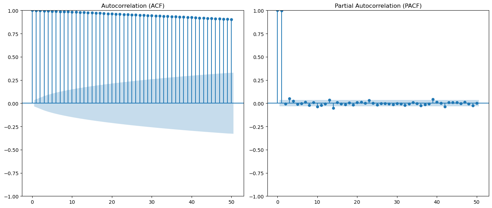

```python
import pandas as pd
import numpy as np
import matplotlib.pyplot as plt
%matplotlib inline
import seaborn as sns
import warnings
warnings.filterwarnings('ignore')
```


```python
df = pd.read_csv('BAJAJFINSV.csv')

df.head()
```


<div>
<style scoped>
    .dataframe tbody tr th:only-of-type {
        vertical-align: middle;
    }

    .dataframe tbody tr th {
        vertical-align: top;
    }

    .dataframe thead th {
        text-align: right;
    }
</style>
<table border="1" class="dataframe">
  <thead>
    <tr style="text-align: right;">
      <th></th>
      <th>Date</th>
      <th>Symbol</th>
      <th>Series</th>
      <th>Prev Close</th>
      <th>Open</th>
      <th>High</th>
      <th>Low</th>
      <th>Last</th>
      <th>Close</th>
      <th>VWAP</th>
      <th>Volume</th>
      <th>Turnover</th>
      <th>Trades</th>
      <th>Deliverable Volume</th>
      <th>%Deliverble</th>
    </tr>
  </thead>
  <tbody>
    <tr>
      <th>0</th>
      <td>2008-05-26</td>
      <td>BAJAJFINSV</td>
      <td>EQ</td>
      <td>2101.05</td>
      <td>600.00</td>
      <td>619.00</td>
      <td>501.0</td>
      <td>505.1</td>
      <td>509.10</td>
      <td>548.85</td>
      <td>3145446</td>
      <td>1.726368e+14</td>
      <td>NaN</td>
      <td>908264</td>
      <td>0.2888</td>
    </tr>
    <tr>
      <th>1</th>
      <td>2008-05-27</td>
      <td>BAJAJFINSV</td>
      <td>EQ</td>
      <td>509.10</td>
      <td>505.00</td>
      <td>610.95</td>
      <td>491.1</td>
      <td>564.0</td>
      <td>554.65</td>
      <td>572.15</td>
      <td>4349144</td>
      <td>2.488370e+14</td>
      <td>NaN</td>
      <td>677627</td>
      <td>0.1558</td>
    </tr>
    <tr>
      <th>2</th>
      <td>2008-05-28</td>
      <td>BAJAJFINSV</td>
      <td>EQ</td>
      <td>554.65</td>
      <td>564.00</td>
      <td>665.60</td>
      <td>564.0</td>
      <td>643.0</td>
      <td>640.95</td>
      <td>618.37</td>
      <td>4588759</td>
      <td>2.837530e+14</td>
      <td>NaN</td>
      <td>774895</td>
      <td>0.1689</td>
    </tr>
    <tr>
      <th>3</th>
      <td>2008-05-29</td>
      <td>BAJAJFINSV</td>
      <td>EQ</td>
      <td>640.95</td>
      <td>656.65</td>
      <td>703.00</td>
      <td>608.0</td>
      <td>634.5</td>
      <td>632.40</td>
      <td>659.60</td>
      <td>4522302</td>
      <td>2.982921e+14</td>
      <td>NaN</td>
      <td>1006161</td>
      <td>0.2225</td>
    </tr>
    <tr>
      <th>4</th>
      <td>2008-05-30</td>
      <td>BAJAJFINSV</td>
      <td>EQ</td>
      <td>632.40</td>
      <td>642.40</td>
      <td>668.00</td>
      <td>588.3</td>
      <td>647.0</td>
      <td>644.00</td>
      <td>636.41</td>
      <td>3057669</td>
      <td>1.945929e+14</td>
      <td>NaN</td>
      <td>462832</td>
      <td>0.1514</td>
    </tr>
  </tbody>
</table>
</div>


```python
df.info()
```

    <class 'pandas.core.frame.DataFrame'>
    RangeIndex: 3201 entries, 0 to 3200
    Data columns (total 15 columns):
     #   Column              Non-Null Count  Dtype  
    ---  ------              --------------  -----  
     0   Date                3201 non-null   object 
     1   Symbol              3201 non-null   object 
     2   Series              3201 non-null   object 
     3   Prev Close          3201 non-null   float64
     4   Open                3201 non-null   float64
     5   High                3201 non-null   float64
     6   Low                 3201 non-null   float64
     7   Last                3201 non-null   float64
     8   Close               3201 non-null   float64
     9   VWAP                3201 non-null   float64
     10  Volume              3201 non-null   int64  
     11  Turnover            3201 non-null   float64
     12  Trades              2456 non-null   float64
     13  Deliverable Volume  3201 non-null   int64  
     14  %Deliverble         3201 non-null   float64
    dtypes: float64(10), int64(2), object(3)
    memory usage: 375.2+ KB


```python
df.shape
```


    (3201, 15)


```python
df.describe()
```


<div>
<style scoped>
    .dataframe tbody tr th:only-of-type {
        vertical-align: middle;
    }

    .dataframe tbody tr th {
        vertical-align: top;
    }

    .dataframe thead th {
        text-align: right;
    }
</style>
<table border="1" class="dataframe">
  <thead>
    <tr style="text-align: right;">
      <th></th>
      <th>Prev Close</th>
      <th>Open</th>
      <th>High</th>
      <th>Low</th>
      <th>Last</th>
      <th>Close</th>
      <th>VWAP</th>
      <th>Volume</th>
      <th>Turnover</th>
      <th>Trades</th>
      <th>Deliverable Volume</th>
      <th>%Deliverble</th>
    </tr>
  </thead>
  <tbody>
    <tr>
      <th>count</th>
      <td>3201.000000</td>
      <td>3201.000000</td>
      <td>3201.000000</td>
      <td>3201.000000</td>
      <td>3201.000000</td>
      <td>3201.000000</td>
      <td>3201.000000</td>
      <td>3.201000e+03</td>
      <td>3.201000e+03</td>
      <td>2456.000000</td>
      <td>3.201000e+03</td>
      <td>3201.000000</td>
    </tr>
    <tr>
      <th>mean</th>
      <td>2755.864386</td>
      <td>2760.382381</td>
      <td>2803.614449</td>
      <td>2716.731443</td>
      <td>2758.781537</td>
      <td>2758.657451</td>
      <td>2761.156954</td>
      <td>2.315312e+05</td>
      <td>9.533424e+13</td>
      <td>20892.811075</td>
      <td>7.409510e+04</td>
      <td>0.471614</td>
    </tr>
    <tr>
      <th>std</th>
      <td>2869.811765</td>
      <td>2874.814173</td>
      <td>2912.885262</td>
      <td>2834.037357</td>
      <td>2873.792614</td>
      <td>2873.522615</td>
      <td>2874.033545</td>
      <td>4.402681e+05</td>
      <td>2.176448e+14</td>
      <td>32396.302068</td>
      <td>1.464012e+05</td>
      <td>0.218910</td>
    </tr>
    <tr>
      <th>min</th>
      <td>90.750000</td>
      <td>88.150000</td>
      <td>93.100000</td>
      <td>88.150000</td>
      <td>91.000000</td>
      <td>90.750000</td>
      <td>89.260000</td>
      <td>4.570000e+02</td>
      <td>1.376712e+10</td>
      <td>149.000000</td>
      <td>4.560000e+02</td>
      <td>0.056200</td>
    </tr>
    <tr>
      <th>25%</th>
      <td>527.900000</td>
      <td>528.600000</td>
      <td>542.600000</td>
      <td>520.000000</td>
      <td>527.950000</td>
      <td>527.900000</td>
      <td>531.270000</td>
      <td>3.981100e+04</td>
      <td>2.751053e+12</td>
      <td>2951.750000</td>
      <td>2.086300e+04</td>
      <td>0.287400</td>
    </tr>
    <tr>
      <th>50%</th>
      <td>1098.700000</td>
      <td>1095.000000</td>
      <td>1118.000000</td>
      <td>1080.250000</td>
      <td>1100.000000</td>
      <td>1098.700000</td>
      <td>1103.560000</td>
      <td>9.995300e+04</td>
      <td>1.090486e+13</td>
      <td>9450.000000</td>
      <td>4.159700e+04</td>
      <td>0.469700</td>
    </tr>
    <tr>
      <th>75%</th>
      <td>5121.900000</td>
      <td>5120.000000</td>
      <td>5199.800000</td>
      <td>5042.800000</td>
      <td>5115.000000</td>
      <td>5125.100000</td>
      <td>5127.510000</td>
      <td>2.315400e+05</td>
      <td>8.755946e+13</td>
      <td>24439.750000</td>
      <td>8.308900e+04</td>
      <td>0.636000</td>
    </tr>
    <tr>
      <th>max</th>
      <td>11176.550000</td>
      <td>11000.000000</td>
      <td>11300.000000</td>
      <td>10868.700000</td>
      <td>11175.450000</td>
      <td>11176.550000</td>
      <td>11081.780000</td>
      <td>6.271671e+06</td>
      <td>3.394379e+15</td>
      <td>312959.000000</td>
      <td>3.804696e+06</td>
      <td>1.000000</td>
    </tr>
  </tbody>
</table>
</div>


```python
df.isnull().sum()
```


    Date                    0
    Symbol                  0
    Series                  0
    Prev Close              0
    Open                    0
    High                    0
    Low                     0
    Last                    0
    Close                   0
    VWAP                    0
    Volume                  0
    Turnover                0
    Trades                745
    Deliverable Volume      0
    %Deliverble             0
    dtype: int64


```python
df.duplicated().sum()
```


    0


```python
print("\nDate range:", df['Date'].min(), "to", df['Date'].max())
```

    
    Date range: 2008-05-26 to 2021-04-30


```python
df['Date'] = pd.to_datetime(df['Date'])
df.sort_values('Date', inplace=True)

plt.figure(figsize=(12,6))
plt.plot(df['Date'], df['Close'], label='Close Price', color='blue')
plt.xlabel('Date')
plt.ylabel('Price')
plt.title('Stock Close Price Over Time')
plt.legend()
plt.grid(True)
plt.show()
```


    

    


```python
from statsmodels.tsa.stattools import adfuller

df.set_index('Date',inplace=True)
ts = df['Close']
```


```python
rolling_mean = ts.rolling(window = 30).mean()
rolling_std = ts.rolling(window=30).std()
```


```python
plt.figure(figsize=(12,6))
plt.plot(ts,label = 'Original Series',color = 'blue')
plt.plot(rolling_mean,label = 'Rolling Mean(30 days)',color ='red')
plt.plot(rolling_std, label='Rolling Std (30 days)', color='green')
plt.title('Rolling Mean & Standard Deviation')
plt.xlabel('Date')
plt.ylabel('Close Price')
plt.legend()
plt.grid(True)
plt.tight_layout()
plt.show()
```


    

    


```python
adf_result = adfuller(ts.dropna())
print("ADF Test Results:")
print(f"ADF Statistic: {adf_result[0]}")
print(f"p-value: {adf_result[1]}")
print("Critical Values:")
for key, value in adf_result[4].items():
    print(f"   {key}: {value}")
```

    ADF Test Results:
    ADF Statistic: 0.5653524010639519
    p-value: 0.9867297500676576
    Critical Values:
       1%: -3.4324099910200605
       5%: -2.8624501783666307
       10%: -2.5672545087086727


```python
ts_diff = ts.diff().dropna()
plt.figure(figsize=(12,6))
plt.plot(ts_diff, color='purple')
plt.title('First-order Differenced Close Price Series')
plt.xlabel('Date')
plt.ylabel('Differenced Price')
plt.grid(True)
plt.tight_layout()
plt.show()
```


    

    


```python
adf_diff_result = adfuller(ts_diff)
print("ADF Test Results (After First Differencing):")
print(f"ADF Statistic: {adf_diff_result[0]}")
print(f"p-value: {adf_diff_result[1]}")
print("Critical Values:")
for key, value in adf_diff_result[4].items():
    print(f"   {key}: {value}")
```

    ADF Test Results (After First Differencing):
    ADF Statistic: -10.779992095856027
    p-value: 2.268060892314719e-19
    Critical Values:
       1%: -3.4324099910200605
       5%: -2.8624501783666307
       10%: -2.5672545087086727


```python
from statsmodels.graphics.tsaplots import plot_acf, plot_pacf
from statsmodels.tsa.seasonal import seasonal_decompose
```


```python
# --- Trend and Seasonality Decomposition ---
decomposition = seasonal_decompose(ts, model='additive', period=30)

plt.figure(figsize=(14,10))
plt.subplot(411)
plt.plot(decomposition.observed, label='Observed')
plt.legend(loc='upper left')
plt.subplot(412)
plt.plot(decomposition.trend, label='Trend', color='orange')
plt.legend(loc='upper left')
plt.subplot(413)
plt.plot(decomposition.seasonal, label='Seasonality', color='green')
plt.legend(loc='upper left')
plt.subplot(414)
plt.plot(decomposition.resid, label='Residuals', color='red')
plt.legend(loc='upper left')
plt.suptitle('Trend, Seasonality, and Residuals - Additive Decomposition', fontsize=16)
plt.tight_layout()
plt.show()
```


    

    


# Time Series Decomposition Analysis

The charts display an additive decomposition of a time series from 2008 to 2020, breaking it down into its fundamental components:

1. **Observed Data (Blue, Top Chart)**
   This is the original time series showing the raw data values over time. The values range from near 0 to about 10,000. There's a clear upward trend over the years, with a significant increase starting around 2016. There appears to be a notable drop around early 2020 (likely related to the COVID-19 pandemic) followed by a recovery.

2. **Trend Component (Yellow, Second Chart)**
   This isolates the long-term progression of the series after removing seasonality and noise. The trend shows a steady, gradual increase from 2008 to 2014, followed by a more pronounced upward trajectory from 2015 to 2018. Around 2020, there's a significant dip (matching the observed data) followed by a recovery to previous levels.

3. **Seasonality Component (Green, Third Chart)**
   This shows the regular, periodic fluctuations in the data. The consistent pattern of peaks and valleys indicates a regular seasonal cycle that repeats throughout the entire time period. The amplitude of these seasonal variations appears relatively stable, generally ranging between -20 and +10 units.

4. **Residuals (Red, Bottom Chart)**
   These represent the irregular or random variations in the data after removing trend and seasonality. Residuals should ideally look like random noise without patterns. In this case, the residuals appear relatively small and random until around 2016-2017, when they become larger and more volatile. This suggests that the variability in the data increased in later years, with a particularly large negative spike visible around 2020.


```python
# --- Autocorrelation and Partial Autocorrelation ---
plt.figure(figsize=(14,6))

plt.subplot(1, 2, 1)
plot_acf(ts.dropna(), lags=50, ax=plt.gca())
plt.title('Autocorrelation (ACF)')

plt.subplot(1, 2, 2)
plot_pacf(ts.dropna(), lags=50, ax=plt.gca(), method='ywm')
plt.title('Partial Autocorrelation (PACF)')

plt.tight_layout()
plt.show()
```


    

    


```python
# Only convert and set index if 'Date' is still a column
if 'Date' in df.columns:
    df['Date'] = pd.to_datetime(df['Date'])
    df.set_index('Date', inplace=True)

# Extract Close price and handle missing values
ts = df['Close'].asfreq('B').fillna(method='ffill')

# Plot ACF and PACF
fig, axes = plt.subplots(1, 2, figsize=(16, 5))
plot_acf(ts.diff().dropna(), ax=axes[0], lags=40)
plot_pacf(ts.diff().dropna(), ax=axes[1], lags=40)
axes[0].set_title('Autocorrelation Function (ACF)')
axes[1].set_title('Partial Autocorrelation Function (PACF)')
plt.tight_layout()
plt.show()
```


    

    


```python
from statsmodels.tsa.arima.model import ARIMA
```


```python
model = ARIMA(ts, order = (2,1,2))
model_fit = model.fit()
```

    C:\Users\user\anaconda3\Lib\site-packages\statsmodels\base\model.py:607: ConvergenceWarning: Maximum Likelihood optimization failed to converge. Check mle_retvals
      warnings.warn("Maximum Likelihood optimization failed to "


```python
print(model_fit.summary())
```

                                   SARIMAX Results                                
    ==============================================================================
    Dep. Variable:                  Close   No. Observations:                 3375
    Model:                 ARIMA(2, 1, 2)   Log Likelihood              -19946.132
    Date:                Tue, 13 May 2025   AIC                          39902.263
    Time:                        17:12:36   BIC                          39932.882
    Sample:                    05-26-2008   HQIC                         39913.211
                             - 04-30-2021                                         
    Covariance Type:                  opg                                         
    ==============================================================================
                     coef    std err          z      P>|z|      [0.025      0.975]
    ------------------------------------------------------------------------------
    ar.L1          1.8605      0.012    158.079      0.000       1.837       1.884
    ar.L2         -0.9099      0.012    -76.499      0.000      -0.933      -0.887
    ma.L1         -1.8812      0.010   -192.258      0.000      -1.900      -1.862
    ma.L2          0.9414      0.009     99.126      0.000       0.923       0.960
    sigma2      7877.5906     48.638    161.964      0.000    7782.262    7972.919
    ===================================================================================
    Ljung-Box (L1) (Q):                   0.10   Jarque-Bera (JB):            280446.70
    Prob(Q):                              0.75   Prob(JB):                         0.00
    Heteroskedasticity (H):             129.31   Skew:                            -1.00
    Prob(H) (two-sided):                  0.00   Kurtosis:                        47.62
    ===================================================================================
    
    Warnings:
    [1] Covariance matrix calculated using the outer product of gradients (complex-step).


## ARIMA Model Results

The fitted ARIMA model shows:

* **AR(1) & AR(2)** terms (`ar.L1`, `ar.L2`) and
* **MA(1) & MA(2)** terms (`ma.L1`, `ma.L2`) are all statistically significant (*p-values < 0.05*).
* **AIC = 39902.161** and **BIC = 39932.781**: These metrics are used for model comparison (lower is better).
* `sigma2` is the estimated variance of the residuals.
* **Warning:** *ConvergenceWarning* suggests the model took longer to fit or had difficulty converging — not unusual for complex ARIMA models, but something to watch if model diagnostics perform poorly.


```python
forecast_step = 30
forecast = model_fit.get_forecast(steps = forecast_step)
forecast_mean = forecast.predicted_mean
conf_int = forecast.conf_int()
```


```python
plt.figure(figsize=(14, 6))
plt.plot(ts, label='Actual', color='blue')
plt.plot(forecast_mean.index, forecast_mean, label='Forecast', color='red')
plt.fill_between(forecast_mean.index, 
                 conf_int.iloc[:, 0], 
                 conf_int.iloc[:, 1], 
                 color='pink', alpha=0.3, label='Confidence Interval')

plt.title('ARIMA Forecast vs Actual (Next 30 Days)')
plt.xlabel('Date')
plt.ylabel('Stock Price')
plt.legend()
plt.grid(True)
plt.show()
```


    

    


## Stock Price Forecast Analysis

* **Upward Trend (2008–2021):**
  * The stock price shows long-term **growth**, with some volatility — especially around 2020 (likely due to COVID-19 crash and rebound).
* **Forecast Segment:**
  * The forecast (red) starts where the actual data ends (~late 2021).
  * It **continues the upward trend**, reflecting what the ARIMA model "learned" from past data.
* **Confidence Interval:**
  * The pink shaded area grows wider — this is common in time series forecasting.
  * It shows that the model becomes **less certain** the further it predicts into the future.


```python
from sklearn.metrics import mean_squared_error, mean_absolute_error
```


```python
pred = model_fit.predict(start =1,end = len(ts)-1,typ = 'levels')
actual = ts[1:]
rmse = np.sqrt(mean_squared_error(actual, pred))
mae = mean_absolute_error(actual, pred)
mape = np.mean(np.abs((actual - pred) / actual)) * 100

print(f"RMSE: {rmse:.2f}")
print(f"MAE : {mae:.2f}")
print(f"MAPE: {mape:.2f}%")
```

    RMSE: 89.36
    MAE : 41.72
    MAPE: 1.66%


## Forecast Accuracy Metrics

| Metric | Value | Interpretation |
|--------|-------|---------------|
| **RMSE** | `89.36` | On average, the prediction deviates from the actual value by ~89 units. Lower is better. |
| **MAE** | `41.72` | The average **absolute** difference between predicted and actual prices. Very useful and interpretable. |
| **MAPE** | `1.66%` | The average prediction error is only about **1.66%** of the actual value — this is **very accurate** for a stock model. |


```python
from sklearn.preprocessing import MinMaxScaler
import tensorflow as tf
from tensorflow.keras.models import Sequential
from tensorflow.keras.layers import LSTM, Dense,Dropout
from tensorflow.keras.optimizers import Adam
```


```python
close_data = df[['Close']].values
```


```python
scaler = MinMaxScaler(feature_range=(0,1))
scaled_data = scaler.fit_transform(close_data)
```


```python
def create_sequences(data, time_steps=60):
    X, y = [], []
    for i in range(time_steps, len(data)):
        X.append(data[i - time_steps:i, 0])
        y.append(data[i, 0])
    return np.array(X), np.array(y)

X_train, y_train = create_sequences(train_data)
X_test, y_test = create_sequences(test_data)
```


```python
time_steps = 60
total_points = len(scaled_data)
```


```python
if total_points <= time_steps + 10:
    raise ValueError("Dataset too small to create sequences for LSTM. Add more data.")
```


```python
train_size = total_points - time_steps
train_data = scaled_data[:train_size]
test_data = scaled_data[train_size - time_steps:]
```


```python

```


```python
if X_test.size > 0:
    X_train = X_train.reshape((X_train.shape[0], X_train.shape[1], 1))
    X_test = X_test.reshape((X_test.shape[0], X_test.shape[1], 1))
    print("Shapes after reshape:")
    print(f"X_train: {X_train.shape}, y_train: {y_train.shape}")
    print(f"X_test: {X_test.shape}, y_test: {y_test.shape}")
else:
    raise ValueError("X_test is empty after sequence creation. Cannot proceed to training.")
```

    Shapes after reshape:
    X_train: (3081, 60, 1), y_train: (3081,)
    X_test: (60, 60, 1), y_test: (60,)


```python
model = Sequential()
model.add(LSTM(units=50, return_sequences=False, input_shape=(X_train.shape[1], 1)))
model.add(Dense(1))
```


```python
model.compile(optimizer=Adam(learning_rate=0.001), loss='mean_squared_error')
```


```python
history = model.fit(
    X_train, y_train,
    validation_data=(X_test, y_test),
    epochs=20,
    batch_size=32,
    verbose=1
)
```

    Epoch 1/20
    97/97 ━━━━━━━━━━━━━━━━━━━━ 8s 41ms/step - loss: 0.0206 - val_loss: 0.0027
    Epoch 2/20
    97/97 ━━━━━━━━━━━━━━━━━━━━ 3s 34ms/step - loss: 3.7586e-04 - val_loss: 0.0022
    Epoch 3/20
    97/97 ━━━━━━━━━━━━━━━━━━━━ 3s 33ms/step - loss: 3.8330e-04 - val_loss: 0.0014
    Epoch 4/20
    97/97 ━━━━━━━━━━━━━━━━━━━━ 3s 34ms/step - loss: 2.7329e-04 - val_loss: 0.0014
    Epoch 5/20
    97/97 ━━━━━━━━━━━━━━━━━━━━ 3s 32ms/step - loss: 2.5317e-04 - val_loss: 0.0011
    Epoch 6/20
    97/97 ━━━━━━━━━━━━━━━━━━━━ 3s 33ms/step - loss: 2.7446e-04 - val_loss: 0.0011
    Epoch 7/20
    97/97 ━━━━━━━━━━━━━━━━━━━━ 3s 34ms/step - loss: 2.1905e-04 - val_loss: 0.0016
    Epoch 8/20
    97/97 ━━━━━━━━━━━━━━━━━━━━ 3s 32ms/step - loss: 2.3466e-04 - val_loss: 0.0017
    Epoch 9/20
    97/97 ━━━━━━━━━━━━━━━━━━━━ 3s 31ms/step - loss: 2.1695e-04 - val_loss: 0.0016
    Epoch 10/20
    97/97 ━━━━━━━━━━━━━━━━━━━━ 3s 31ms/step - loss: 1.9099e-04 - val_loss: 0.0017
    Epoch 11/20
    97/97 ━━━━━━━━━━━━━━━━━━━━ 3s 32ms/step - loss: 2.4357e-04 - val_loss: 8.5852e-04
    Epoch 12/20
    97/97 ━━━━━━━━━━━━━━━━━━━━ 3s 31ms/step - loss: 1.7996e-04 - val_loss: 9.0509e-04
    Epoch 13/20
    97/97 ━━━━━━━━━━━━━━━━━━━━ 3s 33ms/step - loss: 1.7546e-04 - val_loss: 9.2601e-04
    Epoch 14/20
    97/97 ━━━━━━━━━━━━━━━━━━━━ 3s 33ms/step - loss: 1.9332e-04 - val_loss: 0.0022
    Epoch 15/20
    97/97 ━━━━━━━━━━━━━━━━━━━━ 3s 34ms/step - loss: 2.2397e-04 - val_loss: 0.0012
    Epoch 16/20
    97/97 ━━━━━━━━━━━━━━━━━━━━ 3s 33ms/step - loss: 1.6496e-04 - val_loss: 8.0887e-04
    Epoch 17/20
    97/97 ━━━━━━━━━━━━━━━━━━━━ 3s 32ms/step - loss: 1.5597e-04 - val_loss: 9.0839e-04
    Epoch 18/20
    97/97 ━━━━━━━━━━━━━━━━━━━━ 3s 33ms/step - loss: 1.4183e-04 - val_loss: 7.3668e-04
    Epoch 19/20
    97/97 ━━━━━━━━━━━━━━━━━━━━ 3s 34ms/step - loss: 1.5558e-04 - val_loss: 0.0012
    Epoch 20/20
    97/97 ━━━━━━━━━━━━━━━━━━━━ 3s 33ms/step - loss: 1.3976e-04 - val_loss: 0.0014


```python
model.summary()
```


<pre style="white-space:pre;overflow-x:auto;line-height:normal;font-family:Menlo,'DejaVu Sans Mono',consolas,'Courier New',monospace"><span style="font-weight: bold">Model: "sequential"</span>
</pre>


<pre style="white-space:pre;overflow-x:auto;line-height:normal;font-family:Menlo,'DejaVu Sans Mono',consolas,'Courier New',monospace">┏━━━━━━━━━━━━━━━━━━━━━━━━━━━━━━━━━━━━━━┳━━━━━━━━━━━━━━━━━━━━━━━━━━━━━┳━━━━━━━━━━━━━━━━━┓
┃<span style="font-weight: bold"> Layer (type)                         </span>┃<span style="font-weight: bold"> Output Shape                </span>┃<span style="font-weight: bold">         Param # </span>┃
┡━━━━━━━━━━━━━━━━━━━━━━━━━━━━━━━━━━━━━━╇━━━━━━━━━━━━━━━━━━━━━━━━━━━━━╇━━━━━━━━━━━━━━━━━┩
│ lstm (<span style="color: #0087ff; text-decoration-color: #0087ff">LSTM</span>)                          │ (<span style="color: #00d7ff; text-decoration-color: #00d7ff">None</span>, <span style="color: #00af00; text-decoration-color: #00af00">50</span>)                  │          <span style="color: #00af00; text-decoration-color: #00af00">10,400</span> │
├──────────────────────────────────────┼─────────────────────────────┼─────────────────┤
│ dense (<span style="color: #0087ff; text-decoration-color: #0087ff">Dense</span>)                        │ (<span style="color: #00d7ff; text-decoration-color: #00d7ff">None</span>, <span style="color: #00af00; text-decoration-color: #00af00">1</span>)                   │              <span style="color: #00af00; text-decoration-color: #00af00">51</span> │
└──────────────────────────────────────┴─────────────────────────────┴─────────────────┘
</pre>


<pre style="white-space:pre;overflow-x:auto;line-height:normal;font-family:Menlo,'DejaVu Sans Mono',consolas,'Courier New',monospace"><span style="font-weight: bold"> Total params: </span><span style="color: #00af00; text-decoration-color: #00af00">31,355</span> (122.48 KB)
</pre>


<pre style="white-space:pre;overflow-x:auto;line-height:normal;font-family:Menlo,'DejaVu Sans Mono',consolas,'Courier New',monospace"><span style="font-weight: bold"> Trainable params: </span><span style="color: #00af00; text-decoration-color: #00af00">10,451</span> (40.82 KB)
</pre>


<pre style="white-space:pre;overflow-x:auto;line-height:normal;font-family:Menlo,'DejaVu Sans Mono',consolas,'Courier New',monospace"><span style="font-weight: bold"> Non-trainable params: </span><span style="color: #00af00; text-decoration-color: #00af00">0</span> (0.00 B)
</pre>


<pre style="white-space:pre;overflow-x:auto;line-height:normal;font-family:Menlo,'DejaVu Sans Mono',consolas,'Courier New',monospace"><span style="font-weight: bold"> Optimizer params: </span><span style="color: #00af00; text-decoration-color: #00af00">20,904</span> (81.66 KB)
</pre>


```python
plt.figure(figsize=(10,5))
plt.plot(history.history['loss'],label ='Training Loss',color = 'blue')
plt.plot(history.history['val_loss'],label ='Validation Loss',color = 'red')
plt.title("Training Vs Validation Loss")
plt.xlabel('Epochs')
plt.ylabel('Loss (MSE)')
plt.legend()
plt.grid(True)
plt.tight_layout()
plt.show()
```


    

    


```python
y_pred_scaled = model.predict(X_test)
```

    2/2 ━━━━━━━━━━━━━━━━━━━━ 1s 374ms/step


```python
y_pred = scaler.inverse_transform(y_pred_scaled)
y_actual = scaler.inverse_transform(y_test.reshape(-1, 1))
```


```python
rmse = np.sqrt(mean_squared_error(y_actual,y_pred))
mae = mean_absolute_error(y_actual,y_pred)
mape = np.mean(np.abs((y_actual - y_pred) / y_actual)) * 100
```


```python
print(f"Evaluation Metrics:")
print(f"RMSE: {rmse:.2f}")
print(f"MAE: {mae:.2f}")
print(f"MAPE: {mape:.2f}%")
```

    Evaluation Metrics:
    RMSE: 418.81
    MAE: 337.63
    MAPE: 3.38%


## Stock Price Model Performance Metrics

| Metric | Value | Interpretation |
|--------|-------|---------------|
| **RMSE** | 418.81 | On average, predictions deviate by ~₹418 from actual values. RMSE penalizes large errors. |
| **MAE** | 337.63 | Average absolute error is ~₹337.63 — this is a direct indication of deviation. |
| **MAPE** | 3.38% | Your model is, on average, **96.6% accurate** in predicting stock price! This is very good. |


```python
plt.figure(figsize=(12, 6))
plt.plot(y_actual, label='Actual', color='blue')
plt.plot(y_pred, label='Predicted (LSTM)', color='red')
plt.title('LSTM: Actual vs Predicted Stock Prices')
plt.xlabel('Time')
plt.ylabel('Stock Price')
plt.legend()
plt.grid(True)
plt.show()
```


    

    


```python

```
